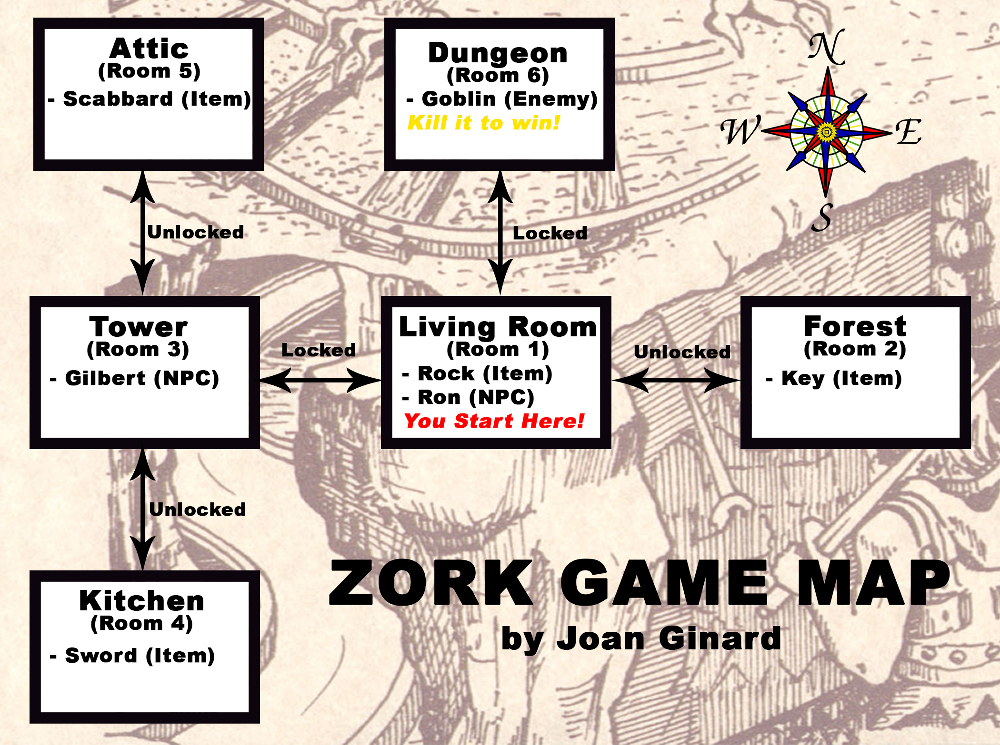
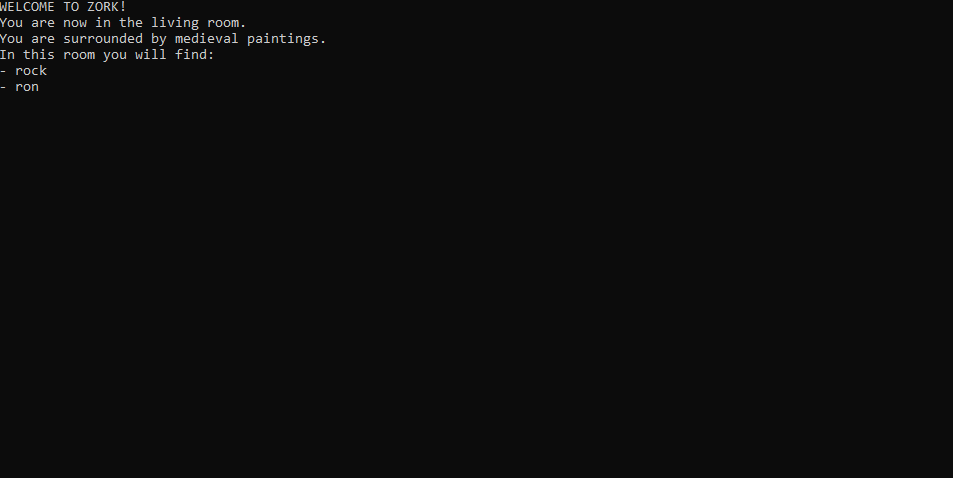

# C++ Simple Zork Game
This is a replica in a small version of the classic text adventure game "Zork" by Infocom (1977). 

  
  
  
  
  
  

## Game Map

## How To Play
In order to play, you must specify an action for example **"look"** or **"grab"** followed by an object **"rock"** or **"sword"** for example (both either lowercase or uppercase). 
To move or attack, you must always specify a direction (north, west, south, east).
**To retrieve all possible actions type _"help"_ to view them.**
You start in room 1 with no objects.
In order to grab a sword you need a holder (aka "scabbard") to put it inside. Also, to use an object like "lock" with a "key" or "attack" with a "sword",
you must have that item equipped.

## How To Beat The Game
To beat the game, you must:
1. Go to room 2 and grab "key"
2. Go to room 1, equip "key" and unlock and go to room 3
3. Go to room 5 and grab the "scabbard"
4. Go to room 4 and grab the "sword"
5. Go to room 1 and unlock and go to room 6
6. Equip "sword" and attack monster until you kill it!

## Extras
At any room, if there is an exit if you have a key equipped you can lock or unlock it at any time.
Additionally, when you enter room 6 you must fight the monster which has 3 lives. It will be hiding, so you will need to specify a direction to hit it.
Furthermore, apart from looking at entities like NPCs, you can also talk to them (it only prints a sentence).
